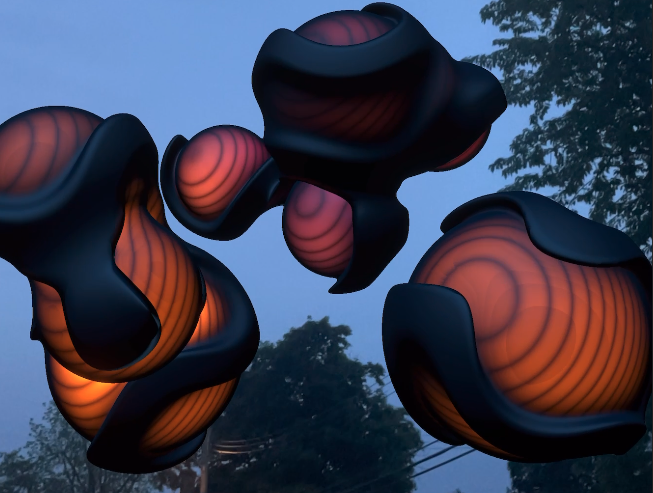

# xr-audio-vfx-mobile

### Abstract
The production value of music festivals has expanded enormously over the last decade, yet there are obvious constraints to what's possible in a physical environment. In contrast, digital worlds have few limitations, allowing the laws of physics to be ignored.

### Goals
This project aims to connect both physical and digital settings in order to push the boundaries of what's possible for real-time, live visual effects. The ultimate vision is to create a fully immersive experience on mixed reality headsets that breaks down the current barriers of mobile AR. 

### What you'll find
This repo includes my current implemetation of the app, with scripts that take a device's microphone data, split it into frequency bands, and normalize it so it can be easily used to drive behavior of various visual effects. There are also a handful of effects at various stages of development.

To learn more and see some of various iterations of the project, check out the ongoing project page in my portfolio [here](https://www.samstrong.design/xr-audio-vfx), or see the most recent iteration [here](https://www.samstrong.design/flowlab).

